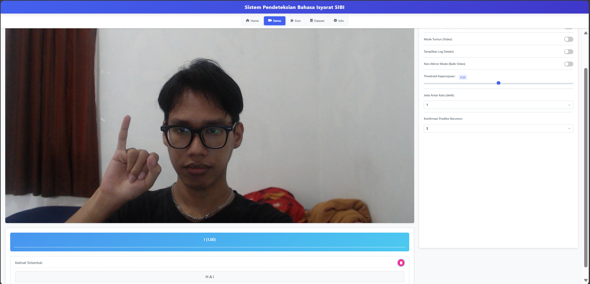

# 🤟 SIBI Detector – Indonesian Sign Language Recognition System

A final-year capstone project focused on building a real-time Indonesian Sign Language (SIBI) recognition system using **MediaPipe** and **custom-trained gesture recognition models**. This project aims to improve accessibility for the deaf community by translating hand gestures into readable text through a web-based AI application.

---

## 🔍 Overview

**SIBI Detector** is a web application that captures and classifies hand gestures from a webcam feed using MediaPipe and displays the translated output in Bahasa Indonesia. It supports live detection of custom-trained gestures for common SIBI words.

---

## 📊 Dataset

The dataset used for training the custom SIBI hand gesture model is available on Kaggle. It contains annotated images of hand gestures representing various SIBI words, collected and preprocessed for model training.

🔗 [View Dataset on Kaggle]([https://www.kaggle.com/your-username/sibi-dataset](https://www.kaggle.com/datasets/aprioadam/sibi-sistem-isyarat-bahasa-indonesia/data)

> The dataset was cleaned and labeled manually to suit real-time classification using MediaPipe and TensorFlow Lite.

---

## 🚀 Features

- Real-time hand gesture detection with MediaPipe
- Custom model trained for specific SIBI gestures
- Translation of gestures into text
- Web interface with camera input
- Responsive and easy-to-use interface
- Accessible and inclusive design

---

## 🛠️ Tech Stack

- **Python**
- **MediaPipe** (Gesture Recognition, Hand Landmark)
- **TensorFlow Lite**
- **Flask** (Web Framework)
- **HTML/CSS/JavaScript**
- **Node.js (Optional for frontend extensions)**

---

## 🧠 How It Works

1. The system accesses the camera feed via a web browser.
2. MediaPipe detects hand landmarks and classifies them using a trained gesture model.
3. Recognized gestures are mapped to predefined SIBI vocabulary.
4. The translation is displayed in real-time on the web interface.

---

## ✅ Requirements

Install Python dependencies:

```bash
pip install -r requirements.txt
```

Run the application locally:

```bash
python app.py
```

Then open your browser at: `http://localhost:5000`

---

## 📸 Screenshots

### Interface Tampilan Web


---

## 🌐 Acknowledgments

* [Google's MediaPipe](https://mediapipe.dev/)
* [TensorFlow Lite](https://www.tensorflow.org/lite)
* Universitas Prasetiya Mulya – Capstone Project 2025

```

